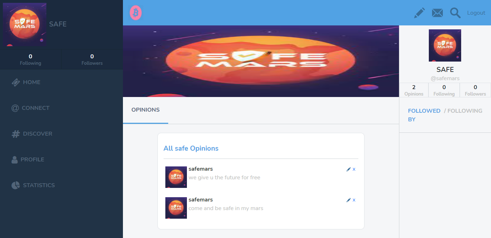

# Ruby on Rails Capstone Project.
This project entails redesigning a Twitter social media web app to share opinions about tourism. I referred to a lot of previous knowledge from previous modules, incorporating the skills gotten from HTML/CSS/bootstrap, and ruby and rails to implement a simple MVP app.

The project has a Sign up/Login section with a username as the required login parameter (as required).  The user is to have a photo to depict on his profile/opinions and also a  cover image that declares his profile. These images are in URL form, and if he chooses to be shy about his face, he can use the default image.

Having logged in the user can view other user's posts about crypto on a general 'timeline' and on the pane to the right,  users who have an account. 

Logged in the user see a timeline with only opinions of the ones he follows and his own opinions. On that timeline, he can edit/delete his own opinions and on other user's opinions, he can 'retweet' (the created copied opinion will have a link for the original user who created it).

We also have a section, that displays a cover image above for the users’ post.

There is as well as an explicit button to follow/unfollow on the profile user


## Screenshot of the page


## Built With

   - Ruby,
   - Ruby on Rails,
   - SCSS,
   - Bootstrap,
   - Font Awesome,
   - RSpec(Testing)
   - Capybara(Testing)
   - Bullet(Developing)

## Live Demo

[Live Demo Link](https://cryptic-winter.herokuapp.com/)

## Video Presentation

[Project Presentation](https://www.loom.com/share/800ca18284a9437992655cec7ab6a12f)


## Getting Started

You can get a local copy of the repository please run the following commands on your terminal:

```
$ cd <folder>

$ git clone https://github.com/wintan1418/winter-twitter-redesign
```

You need to install the required gems:

```
$ bundle install or bundle update
```

Migrate the database

```
$ rails db:migrate
```

If you want to prepopulate the database you can run the seed.rb file(not required):

```
$ rails db:seed
```

And run the server:

```
$ rails s
```


To navigate on the app you can enter http://localhost:3000/ on your browser, set a new User and you are ready to log in.

## Tests

The tests were created with RSpec, to run the tests you should open the app folder on console and run 
 
```
$ rspec
```

It will run the 3 test files:

- spec/feature/features_spec.rb
- spec/models/following_spec.rb
- spec/models/user_spec.rb

## Authors

👤 **Author**

Oluwadare Juwon

- Github: [@Oluwadare Juwon](https://github.com/wintan1418)
- Linkedin: (www.linkedin.com/in/oluwintan)
- Twitter: [Oluwadare-juwon](https://twitter.com/@oluwadarejuwon)

## 🤝 Contributing

Contributions, issues and feature requests are welcome!

Feel free to check the [issues page](issues/).

## Show your support

Give a ⭐️ if you like this project!
